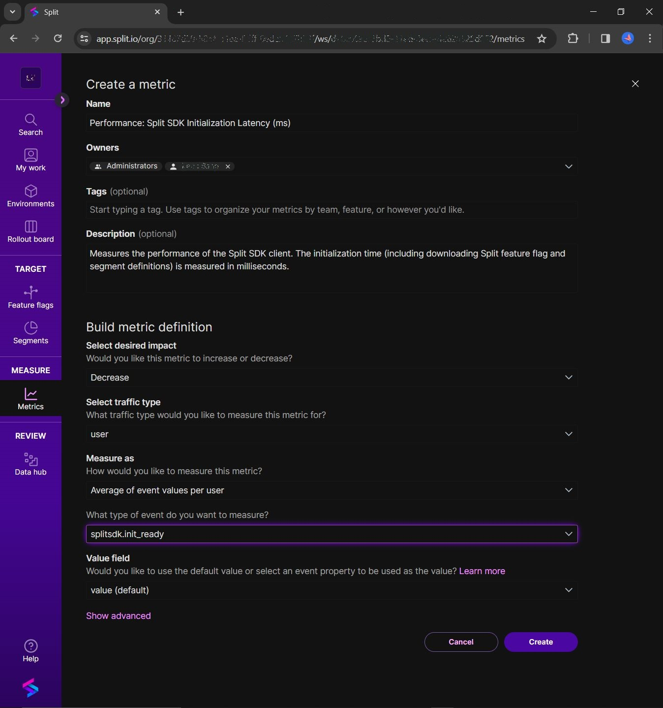
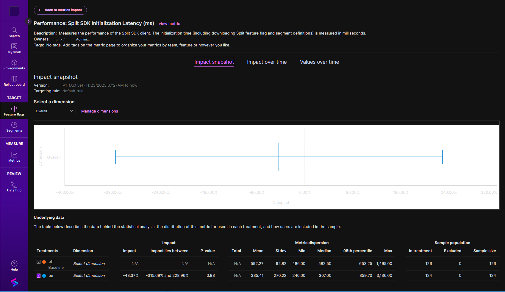

The example consists of an A/B test comparing the performance of two variants of a webpage. A NodeJS server serves these variants behind a feature flag using Split's NodeJS SDK. The webpages are built with Webpack and utilize Split Browser Suite (and internally Split RUM Agent) to capture performance metrics such as page load time and Web Vitals.

One of the webpage variants (treatment 'on') includes filtering by **flag set** to optimize performance, while the other (treatment 'off') doesn't. Both variants load Split Suite using dynamic imports and are built with Webpack's "production" mode, which minifies the code.

An automation script navigates the page multiple times, generating events and impressions for both treatments.

# How to run

This example assumes you have set up feature flags in Split UI, with traffic type 'user'. You should supply the names of these feature flags in your `.env` file.

1. Take a copy of `.env.example` and re-name to `.env`.
2. Add your Split SDK keys and feature flag names to `.env`. (Defaults will be used for any flags that are not created in Split UI or named in the `.env` file.)
3. Run `npm install` to install dependencies.
4. Run `npm run serve` to build the app and start the server. The Web page will be served at `http://localhost:3000/?id=<user-id>`, where `<user-id>` is a unique identifier for the user, used by the Split SDK to bucket the user into a treatment (one of the outcomes defined in each feature flag).

# Contents

- `/client`: source code of the web application and its two variants.
  - `/client/index-on.js`: entry point for the optimized variant, served for treatment `on` of the [feature flag identified by 'FEATURE_FLAG_OPTIMIZE_PAGE'](https://github.com/splitio-examples/flagsets-split-browser-suite/blob/master/.env.example#L4).
  - `/client/index-off.js`: entry point for the default variant, served for treatment `off` of the [feature flag identified by 'FEATURE_FLAG_OPTIMIZE_PAGE'](https://github.com/splitio-examples/flagsets-split-browser-suite/blob/cd153dc513ceac55992b898b4ba84605ec7f8881/.env.example#L4).
- `/webpack.config.js`: Webpack configuration to build the two variants of the application.
- `/dist`: built static assets of the application, generated by Webpack.
- `/server/index.js`: source code of the NodeJS server that implements the endpoint `GET /?id=<user-id>` that serves the two variants of the application behind a feature flag.
- `/automation.js`: automation script to run Puppeteer, navigate to the application and generate events and Split feature flag impressions.

# Script

- `npm run dev`: starts Webpack with watch flag and NodeJS server with Nodemon, so that the application is rebuilt and the server restarted on file changes in the `/client` and `/server` folders respectively, for development purposes.
- `npm run build`: builds the two variants of the application.
- `npm run serve`: builds the two variants of the application and starts the NodeJS server.
- `npm run automation`: runs the automation script that will generate events and impressions by navigating to the webpage multiple times with different user IDs, using [Puppeteer and Chrome](https://www.npmjs.com/package/puppeteer). Before running this script, we recommend you set up a Metric to measure the average Split SDK initialization time, as described in the [Set up a Split Metric and view results](https://github.com/splitio-examples/flagsets-split-browser-suite/tree/flagsets#set-up-a-split-metric-and-view-results) section below.

# Tutorial - Split flag sets - Filtering feature flags for optimized webpage performance

If you'd like to get a taste of the performance improvements possible with flag sets, see the [blog](https://www.split.io/blog/): 'Minimize webpage latency with Split flag sets'. Since you are already peering into the code, check it out and see Split's webpage optimization capabilities in action!

# Set up a Split Metric and view results

To measure the custom event `splitsdk.init_ready` ([created by the client code](https://github.com/splitio-examples/flagsets-split-browser-suite/blob/f2afc82de96243c9f2df03b9fccdfc6db4bb883f/client/split.js#L68-L69)), you'll need to create a metric, as shown below.

You can run the automation script to automate 250 page views. (The command would be: `npm run automation 0 250`.) This allows you to see the metric results in the Split UI.

Open the Split UI, click on a feature flag's Metrics impact tab (you can adjust the **Experimental settings** to `Sequential testing`, with a Minimum sample size of `100`), and analyze the metric results. The ["Metrics impact tab"](https://help.split.io/hc/en-us/articles/360020844451-Metrics-impact-tab) doc describes the metrics analysis and calculations that you can do on this tab.

Click 'View more' on a Metric card to visualize metric measurements.

